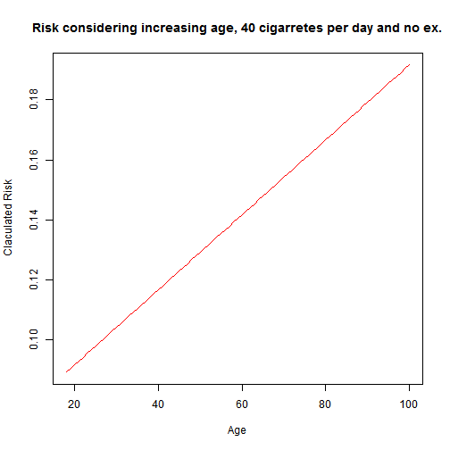

Shiny Death App - Developing Data Products Coursera Final Project
========================================================
author: Renato Pedroso Neto
date: July, 07th - 2016
autosize: true

Project Objective
=======================================================  
This presentation was made as a deliverable data product to complete the "Developing Data Products" course hosted by Coursera and available by John Hopinks.  
You can check more about the course clicking [here](https://www.coursera.org/learn/data-products)  

This project was divided in two parts:  
1) Create a shinny app and host it on [shinyapps.io](www.shinyapps.com/coursera)  
2) Create a presentation hosting on [rpubs](www.rpubs.com) or [github](www.github.com) using the RStudio Presenter or Slidify  

This presentation was created with **RStudio Presenter**  

Description of the App
========================================================

The objective of shiny death app is to show the probability of a person to die
in a certain day. The calculation is based on the life style of each person.  

It's important to note that this probability's calculation is **TOTALLY** invented by the author with **NO** scientific support.  

How to use
========================================================

The usage of the App is pretty simple:  
1) Access the website clicking [here](https://skineer.shinyapps.io/Shiny_Death/).  
2) Input the data as required (if you have any question about the expected values please check the documentation link on the app page).  
3) Click on submit and check the probability of death on the current day.  

Plotting the Linear Risk of Age
========================================================
I will make a plot considering a person that smokes 40 cigarretes per day, no exercises and varying by age to check the linear trend on the risk:  

